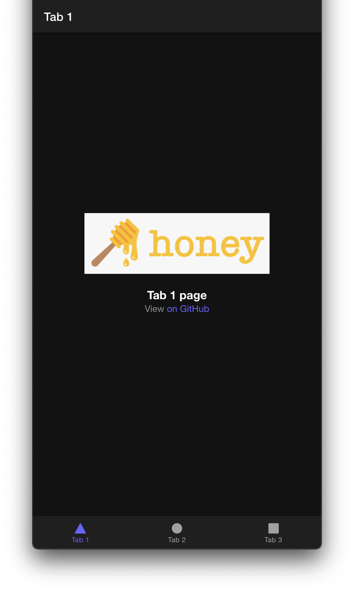

# CI/CD Test App
My first CI/CD workflow test using GitHub Actions and GitHub Pages. You can find the live version of the deployed website here: [https://azurekn1ght.github.io/CICDtest/](https://azurekn1ght.github.io/CICDtest/)

This project was built using [Angular](https://angular.io/) and [Ionic](https://ionicframework.com/) Framework, and deployed to GitHub Pages using an automated workflow enabled by GitHub Actions. The app can also be downloaded locally and compiled for iOS and Android using [Capacitor](https://capacitorjs.com/). 

## CI/CD Workflow
This repository is my first attempt at building an automated CI/CD workflow for and Angular web app project using GitHub Actions and GitHub Pages. The full workflow can be found in the YAML file [.github/workflows/main.yml](.github/workflows/main.yml) and will be described in detail below. 

### 1. Defining the Workflow
	name: CICD
	on:
		push:
		   branches: [master]
		pull_request:
		   branches: [master]
		   
	workflow_dispatch:

The first statement defines the name of the workflow. The next part specifies when the workflow shall run. In this case, it will run whenever there is a "push" or a "pull_request" to the "master" branch only. The last statement also allows for the workflow to be triggered manually from the Actions tab in GitHub. 

### 2. Defining the Jobs 
	jobs:
	  build:
	    name: Build and Deploy
	    runs-on: ubuntu-latest

A workflow run is made up of one or more jobs that can run sequentially or in parallel. This test workflow only consists of one build job called "Build and Deploy". The last statement specifies that the job should be run on the latest version on ubuntu.  

### 3. Defining the Steps of a Job
	steps:
		- name: Checkout
		  uses: actions/checkout@v2

There are two steps in this particular job. The first step called "Checkout" simply performs a checkout of the repository using the action [actions/checkout](https://github.com/marketplace/actions/checkout) so that it is accessible to the job.
	     
		- name: Angular Build and Deploy
		  uses: AhsanAyaz/angular-deploy-gh-pages-actions@v1.3.2
		  with:
		        github_access_token: ${{ secrets.GITHUB_TOKEN }} 
		        base_href: /CICDtest/ 
		        deploy_branch: gh-pages  
		        angular_dist_build_folder: www 
		        
The second step of this job called "Angular Build and Deploy" uses the action [AhsanAyaz/angular-deploy-gh-pages-actions](https://github.com/marketplace/actions/angular-deploy-gh-pages-actions) courtesy of [AhsanAyaz](https://github.com/AhsanAyaz) on the GitHub Actions marketplace. It takes in the "github_access_token" provided using the "secrets.GITHUB_TOKEN" for access, and builds the Angular code for deployment. 

The "base_href" is required to correspond to the format of "https://{your_username}.github.io/{base_href}/" for the Angular build to work correctly. The code is complied from the "angular_dist_build_folder" which is the "www" folder for this project, as specified in the "[angular.json](angular.json)" file. 

Finally, when the build is one, it will be deployed to the "deploy_branch" called "gh-pages", which is the branch of this repository configured for GitHub Pages. The live website will thus be available at: [https://azurekn1ght.github.io/CICDtest/](https://azurekn1ght.github.io/CICDtest/)

